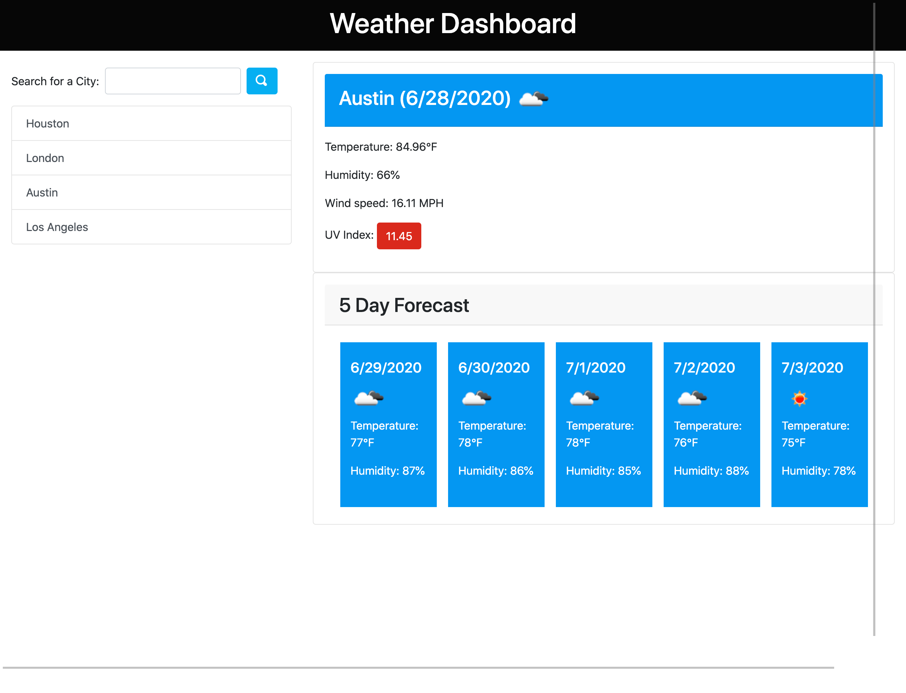

# weather-dashboard

The Weather Dashboard application allows the user to get the current weather and 5 day forecast for a searched city. When the user searches for a city, the application uses the Open Weather Map API to gather the necessary data to display for the user. The application also saves searched cities to a list and able to be searched again by clicking a city.

## Technologies used:
* HTML, CSS
* Bootstrap
* jQuery
* Open Weather Map API

## Items to improve in the future:
* Display correct date of Current weather for searched city. Currently current weather displays local date of user.  

## Deployment:
[d-belleza.github.io/weather-dashboard](http://d-belleza.github.io/weather-dashbord)

